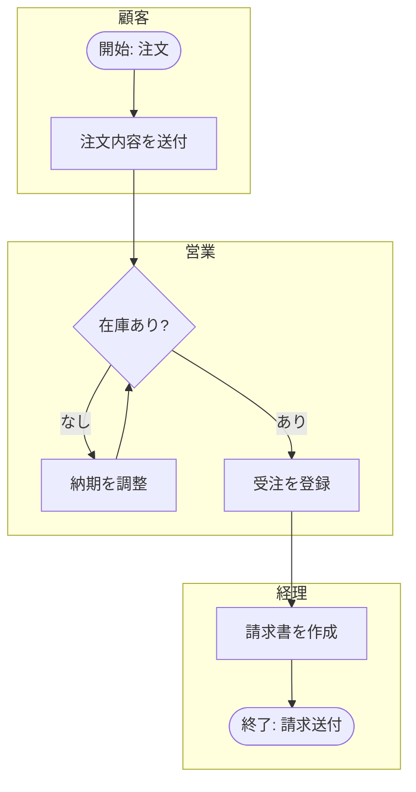

# 業務・サービス設計とシステム化範囲の線引き

**鉄則: 上流の線引きの誤りは、下流でどれだけ綺麗に実装しても回収できない。**

このスキルの最終成果は、クライアントの業務とビジネスを理解した上で
**「システム化する範囲/しない範囲」を根拠付きで線引きすること**。
線引きを誤ると、(a) 作らなくてよいものに予算が溶ける、(b) SaaSで済むものをスクラッチして保守が一生残る、
(c) 標準に合わせるべき業務をカスタマイズして「魔改造」化する——のいずれかで下流が死ぬ。

境界: 要件定義プロセスそのもの → `requirements-definition` 参照。画面・APIの具体化 → `dev-core:external-design-deliverables` 参照。

## 全体フロー

1. **As-Is/To-Be** — 業務の現実を可視化する
2. **ECRSフィルタ** — 排除できる業務をシステム化候補から外す
3. **サービス設計の検証** — そもそも作るべきかを疑う(新規事業・プロダクト案件のみ)
4. **サービスブループリント** — 顧客体験と裏側業務を1枚に接続し、線引きの土台を作る
5. **Buy vs Build 判断** — 作る/買う/標準に合わせるを領域ごとに決める
6. **スコープ確定** — トレードオフを明示し「やらないことリスト」に署名をもらう

## Step 1: As-Is/To-Be 分析(5段階手順)

以下の順序を厳守する。**To-Beを先に描くと願望ベースになる**ため、必ずAs-Isから。

1. **スコープ定義** — 対象業務・部門・境界を決める。業務一覧表(部門×業務×頻度×担当者×使用ツール)を土台にする
2. **ヒアリング** — 実際の帳票・画面を見せてもらいながら聞く(→ なぜ: 口頭説明は美化される)。初回はSIPOC(供給者-入力-プロセス-出力-顧客)の1枚整理で粗く掴むと30分で全体像が出る
3. **ラフスケッチ** — その場で描いて認識ズレを即時に潰す
4. **清書レビュー** — フロー図に版数と確認者を入れ、クライアントに「この通りで合っていますか」と確認を取る(→ なぜ: 後の仕様変更交渉の証跡になる)
5. **課題可視化** — フロー上の課題に番号を振り、定量値(例: 月40時間→目標10時間)を付記する

### ヒアリングで必ず聞く例外フロー

正常系だけのAs-Isは価値が半分以下。少なくとも以下を確認する:

- [ ] 返品・返金が発生したときの流れ
- [ ] キャンセルが発生したときの流れ
- [ ] 承認の差し戻しが起きたときの流れ
- [ ] 月次締め後に訂正が必要になったときの流れ

あわせて守る原則:

- As-Isは**課題が特定できる粒度で止める**(→ なぜ: 精緻化しすぎると工数が溶ける。工数はTo-Beに割く)
- 現場担当者だけでなく**経営層の意図(なぜ変えたいのか)**を必ず聞く
- 「現行踏襲」という要件は鵜呑みにせず、**調査依頼と読み替える**

## Step 2: フロー図の表記(BPMNサブセット)

中小規模のクライアントとの合意形成には、完全なBPMN 2.0準拠より
**「スイムレーン+開始/終了+分岐」だけのサブセット**が実務的。Mermaidで十分。



- スイムレーン(subgraph)= 担当者/部門。開始・終了は `([ ])`、分岐は `{ }` で統一する
- To-Be版では**システム化範囲をレーンや枠囲み・色分けで明示**する(Step 4・6の線引き結果を反映)

**厳密なBPMN 2.0(ISO 19510)を使う条件**: ワークフローエンジンと連携する場合、監査対応が必要な場合。
それ以外は読者が誰かで決める(→ なぜ: 合意形成が先、厳密化は後。表記の厳密さと関係者の理解しやすさは両立しない)。

## Step 3: ECRSフィルタ — 排除できる業務を自動化しない

システム化・自動化・AI導入の検討前に、必ずECRSの順で業務そのものを見直す:

1. **Eliminate(排除)** — その業務は無くせないか
2. **Combine(結合)** — 他の業務とまとめられないか
3. **Rearrange(順序入替)** — 順序を変えれば楽にならないか
4. **Simplify(簡素化)** — 簡単にできないか

**この順序自体が判断基準**。排除できる業務をシステム化してはならない
(→ なぜ: 無駄な工程を自動化すると無駄が固定化される)。
**最良のシステム化範囲は「範囲を狭くすること」であるケースが多い。**

注意: E(排除)の意思決定は必ず人間が行う(→ なぜ: 排除は必ず誰かの仕事を奪うため、合意形成が本体)。

## Step 4: サービス設計の検証 — そもそも作るべきか

新規事業系・プロダクト開発案件では、業務効率ではなく
**「顧客に何を売るか・なぜ選ばれるか」が成立しているか**を先に検証する。

| 道具 | 使いどころ |
|---|---|
| リーンキャンバス | 事業仮説の全体像をキックオフで1枚合わせ。**「課題」から書き始めるのが型** |
| バリュープロポジションキャンバス | クライアントの「欲しい機能リスト」を顧客のジョブに引き当て直し、対応しない機能を削る |
| ジョブ理論(JTBD) | 機能要望の背後の状況と動機を掘る。仕様議論が紛糾したらジョブに立ち返ると優先順位が決まる |

### 危険信号の判定則

- [ ] **ソリューション欄が先に埋まる案件は危険信号**(→ なぜ: 課題が未検証のまま作るものだけが決まっている)
- [ ] クライアントの言う「顧客ニーズ」が実際のエンドユーザーの声か、クライアントの想像かを常に区別する
- [ ] キャンバスは「埋めること」ではなく**どこが仮説(未検証)かを明示すること**が目的。未検証セルに印を付け、検証順を合意する
- [ ] ジョブの深掘り質問: 「最後にそれをしたのはいつですか? そのとき何が起きていましたか?」(過去の事実だけを聞く)

フル検証の予算がつかないときは、**最もリスクの高い仮説1つだけを安く検証する**提案に落とす
(コンシェルジュMVP、LP+広告テスト等)。検証工程自体を小さく受注するのが型。

## Step 5: サービスブループリント = システム化範囲図

顧客のアクションを時系列に並べ、その下に層を重ねる:

```
顧客のアクション   : 問い合わせ → 注文 → 受け取り → 支払い
──────────── 可視線(line of visibility) ────────────
フロントステージ   : 顧客に見える対応(接客・メール・画面)
バックステージ     : 顧客に見えない業務(在庫確認・伝票処理)
サポートプロセス   : システム・外部サービス
```

- カスタマージャーニーマップとの決定的な違いは**可視線より下(裏側の業務)を描くこと**。ブループリントなしでジャーニーマップだけ作ると、バックオフィス業務が実装後に発覚する
- バックステージは現場しか知らないため、**既存業務の関係者を巻き込んで描く**
- **サポートプロセス行の各要素に「Build / Buy(SaaS) / 既存流用 / 手作業のまま」を割り当てれば、この図がそのままシステム化範囲図になる**(→ なぜ: 業務設計とUX設計を1枚で接続でき、線引きの合意形成に直結する)

## Step 6: Buy vs Build 判断

### 6-1. サブドメイン分類 → 投資方針(第一の問い: その機能は競争優位を生むか?)

| 分類 | 定義 | 投資方針 |
|---|---|---|
| コアドメイン | 競争優位の源泉 | **Build**(作り込む) |
| 支援サブドメイン | 必要だが差別化しない | 最小限のBuild またはローコード |
| 汎用サブドメイン | どの会社にもある機能 | **Buy**(SaaS/OSS) |

認証・決済・メール送信・会計・勤怠をスクラッチする提案は**原則として職務怠慢**と考える。
小規模案件でも、サブドメイン分類(とユビキタス言語の用語集)だけは必ず作る。

### 6-2. Fit to Standard の適用条件

業務をSaaS/パッケージの標準機能に合わせるアプローチ。**ギャップは「業務を変える」で埋めるのが第一選択**。

- 適用条件: **その業務が差別化源泉でないこと**(サブドメイン分類とセットで初めて機能する)
- 標準に合わせられない理由が「現場の慣れ」だけなら業務側を変える(経営層の合意を先に取る)。「事業の差別化」ならBuildに切り替える
- カスタマイズは「バージョンアップ追従コストを永久に払う借金」と説明する(→ なぜ: 魔改造パッケージは保守費がスクラッチ並みに膨らむ)

### 6-3. 5年TCO + 撤退コストで比較する

- **単年コストで判断しない**。Buyの初期費用は安く見えるが、統合・トレーニング・カスタマイズで公称価格の1.5〜2倍になりやすいと言われる(目安・2026年時点・要確認)。Buildは初期が重く保守で逓減
- 撤退コスト(ロックイン)を必ず加える: データエクスポート可否とAPI開放度を**契約前に**確認し、撤退シナリオを設計書に書く
- SaaS選定はカタログスペックの○×表で決めず、**実データでのPoCを1〜2週間**行う。Fit & Gapはフィット率だけでなく「ギャップの質」を見る(件数が少なくてもコア業務のギャップは致命的)
- AIによる開発コスト低下でBuild側のTCOは下がっており、従来Buy一択だった支援サブドメインがBuild圏に入り始めている——ただし**保守コストはAIでもゼロにならない**
- 具体的な金額試算・価格提示は本スキルの範囲外。**自組織の見積・価格判断プロセスへ**接続する
- 契約条項(ロックイン・撤退条件等)に関わる部分は法的助言ではなく実務の型。最終判断は専門家に委ねる

## Step 7: スコープ確定と「やらないことリスト」

### トレードオフ表(両立しないものは、決め方を先に合意する)

| 両立しないもの | 決め方 |
|---|---|
| Fit to Standard vs 現場の使い勝手 | 差別化源泉か否かで決める。差別化しないなら業務変更を求める(経営層の合意が先) |
| スクラッチの自由度 vs 保守負担の永続 | 5年TCO+「誰が保守するか」で決める |
| SaaSの速さ vs ロックイン・撤退コスト | エクスポート可否とAPI開放度を契約前に確認。撤退シナリオを設計書に書く |
| 初期スコープの広さ vs 検証の速さ | 「最もリスクの高い業務仮説を検証できる最小範囲」をPhase1にする |
| カスタマイズで埋める vs 業務を変える | カスタマイズは永続する借金として説明し、差別化源泉のみ許容する |
| 手作業のまま残す vs 自動化 | 頻度×件数×エラー影響で決める。月1回・10分・低リスクなら手作業のままが正解のことが多い |

### 「やらないことリスト」の運用

- スコープ定義書のIn/Outのうち、**Out(やらないことリスト)を提案書・要件定義書の独立セクション**にする
- クライアントの**署名(確認)対象**にする(→ なぜ: スコープクリープ防衛の最強の武器になる)
- 段階導入では**Phase1単体で業務が回る切り方**にする(→ なぜ: Phase2以降が永遠に来ない前提を見落とすと業務が宙に浮く)
- 線引きの選択肢は「Build/Buy/手作業」の3つではなく、**「クライアント内製範囲」という第4の選択肢**を入れる(作ってもらう→作れるようになる、への支援ニーズが増えている)

### 保守供給能力を線引き基準に含める(原則)

受託側の保守キャパシティ自体を制約条件として扱う。少人数の受託では自分(自社)が保守主体になるため:

- [ ] 「担当者が不在になっても回る構成か」を線引きの評価項目に入れる
- [ ] SaaS比率を上げる・標準技術に寄せる・ドキュメントをAI可読にする、で保守供給リスクを下げる
- [ ] 「全部作ってほしい」を受注欲で丸呑みしない(→ なぜ: 短期売上と引き換えに保守地獄と信頼毀損を買う。受注範囲を自分で削る誠実さがリピートを生む)

## AIがやること / 人間にしか決められないこと

| フェーズ | AI(このスキルを実行するエージェント)がやること | 人間にしか決められないこと |
|---|---|---|
| As-Is/To-Be | 議事録・録音からのフロー草案生成(Mermaid)、例外パターンの質問リスト生成、フロー図と業務一覧の整合チェック、To-Be案の複数パターン比較 | ヒアリングそのもの(現場の空気・言い淀み・部門間の政治の察知)、「本当は無くしたいが触れない業務」など非公式制約の把握 |
| ECRS | 排除・結合・簡素化の候補列挙 | E(排除)の意思決定と合意形成(誰かの仕事を奪う判断) |
| サービス設計 | 業界・競合の棚卸し、キャンバス草案の複数生成、インタビュー記録からのジョブステートメント抽出 | 顧客インタビューでの深掘り、「この事業は本当にやるべきか」の経営層との対話、ピボットの進言 |
| Buy vs Build | SaaS/OSS候補の網羅調査と機能比較表、Fit & Gap分析表のドラフト、TCO試算モデルの構造化、API/エクスポート仕様調査 | 何がコアドメインか(=競争優位はどこか)の判断、ロックイン・撤退リスクの許容度判断 |
| スコープ確定 | In/Outリストのドラフト、トレードオフ表の作成、線引き根拠の文書化 | 「業務を変えてください」と伝える交渉、自社の受注範囲を削る判断、標準に合わせるか作り込むかの最終決定 |

原則: AIは**調査・生成・整合チェックの網羅性**を担い、人間は**合意形成・経営判断・排除の意思決定**を担う。
かつて調査工数不足で勘に頼っていた線引きの根拠は、AIで網羅的に固められる——だからこそ最後の判断の質が問われる。

## 完了チェックリスト(成果物)

- [ ] 業務一覧表(部門×業務×頻度×担当者×使用ツール)
- [ ] As-Is/To-Be業務フロー図(版数・確認者入り。To-Beはシステム化範囲を色分け)
- [ ] 課題一覧(番号と定量値付き)
- [ ] (新規事業系のみ)リーンキャンバス/VPC — 未検証セルに印、検証順の合意付き
- [ ] サービスブループリント(サポートプロセス行にBuild/Buy/既存流用/手作業/内製の割り当て)
- [ ] サブドメイン分類表とBuy vs Build判断表(5年TCO+撤退コストの根拠付き)
- [ ] Fit & Gap分析表(ギャップの質の評価付き)
- [ ] スコープ定義書(In/Outリスト。Outは署名対象)
- [ ] 段階導入ロードマップ(Phase1単体で業務が回ること)

## 関連スキルへの境界(内容を複製しない)

- 要件定義プロセス・要求の構造化 → `requirements-definition`
- 画面・API・ワイヤーフレームの具体化 → `dev-core:external-design-deliverables`
- クライアントとの合意形成・期待値調整の進め方 → `client-alignment`
- 提案書・報告書などドキュメントの作り方 → `design-core:business-doc-design`
- AI機能を含むシステムの設計判断 → `ai-engineering:ai-system-design`
- 人の承認・確認を業務に残す設計 → `ai-engineering:human-in-the-loop-design`
- DDDの戦術的設計・実装パターン → `dev-core:best-practices`
- 金額・工数の試算と価格提示 → 自組織の見積・価格判断プロセスへ
- 契約条項の設計・レビュー → 法務・契約の専門家へ(本スキルは実務の型のみ扱う)
