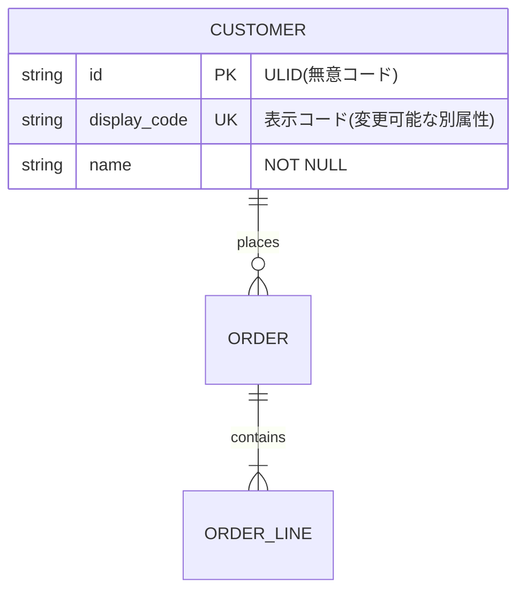

# データ・認証認可の境界設計

**鉄則: データモデルと権限モデルはシステムで最も寿命が長い約束事。コードは書き直せるがデータは移行される。**

UIやAPIより変更が重い層なので、初期の型選びに時間を使うこと。本スキルは
「概念→論理データモデル」「コード設計」「認証(相手が誰か)」「認可(何をしてよいか)」を扱う。

**スコープ外(1行で送る)**:
- 物理設計(インデックス・パーティション)・マイグレーション運用 → dev-core:data-design-ops
- API契約(OpenAPI・バージョニング・エラー形式) → dev-core:interface-contract-design
- 脅威モデリング・セキュリティ要件全般 → dev-core:security-by-design
- Repository・トランザクションの実装パターン → dev-core:backend-patterns
- 要件のヒアリングと合意形成 → delivery-core:requirements-definition

---

## Part 1: データモデル設計

### Step 1: 概念→論理モデルを固める

1. **エンティティ候補を業務の言葉(名詞)で列挙し、用語集と一致させる。**
   なぜ: 命名のブレは設計書全体の検索性と将来の理解可能性を壊す。
2. **ER図は Mermaid erDiagram で書き、git 管理する。**
   なぜ: 差分レビュー・AI生成・クライアント提示のすべてに同じ正本が使える。
3. **第3正規形を既定とする。非正規化は性能要件で必要と証明されてから、理由を記録して例外導入する。**
   なぜ: 非正規化は更新時異常(不整合)と引き換えの高速化であり、既定を逆にしてはいけない。
4. **制約(NOT NULL / FK / UNIQUE / CHECK)は最初から厳密に入れる。**
   なぜ: 制約はスキーマに残る仕様であり、AI実装者に対する最強のガードレール。
5. **加算的変更(カラム追加)だけで進化できる形を狙う。**
   なぜ: カラムの意味変更・型変更は移行計画が必要な破壊的変更で、この層では「後で直す」が最も効かない。

**アンチパターン検査(設計レビュー時に必ず確認)**:
- [ ] EAV(「汎用マスタ」「属性1〜属性10」)がないか — 制約もJOINも効かない負債
- [ ] NULLだらけの巨大テーブルがないか — サブタイプ未分離のサイン
- [ ] 区分値のマジックナンバーが設計書にしか存在しないか — 区分値マスタorチェック制約で意味をスキーマに残す
- [ ] 論理削除フラグの濫用がないか — 削除の業務的意味(取消か無効化か)を設計せず deleted_at を付けていないか。履歴テーブルやステータス遷移で表すべきものが多い

### Step 2: イミュータブルデータモデルと SCD の適用判定

1. **エンティティを「リソース(マスタ)」と「イベント(取引・履歴)」に分ける。イベントは UPDATE せず INSERT のみで積む。**
   なぜ: 監査・履歴要求の強い業務システムで、後から履歴を復元することは不可能に近い。
2. **経験則: 日時属性が2つ以上あるテーブルはイベントが混在しているサイン。分離を検討する。**
3. **SCD Type 2(valid_from / valid_to の有効期間付き行)の適用判定**:
   「過去時点の値で再計算する」要件があるマスタ(単価・組織・税率など)は必ず Type 2。
   その要件がなければ Type 1(上書き)で十分 — 履歴の一律付与は保守コストを無駄に上げる。
4. **各マスタのオーナー(誰が正とするか・更新者・更新頻度)を決めて記録する。**
   なぜ: 複数システム連携時の不整合はほぼここから生まれる(MDMの入口)。

### Step 3: コード設計の原則

1. **主キーは無意コード(サロゲートキー: ULID / UUIDv7)にする。**
   なぜ: 有意コード(桁に意味を持たせる)は組織変更などで意味の前提が変わると破綻する。
2. **人間向けの表示コードは別属性として持ち、変更可能にする。**
   なぜ: 主キーと表示を分離すれば、業務側のコード体系変更がデータ移行にならない。
3. **外部に晒す ID は推測不能にする(ULID / UUIDv7 — 時系列ソート可能でインデックス効率も良い)。**
   なぜ: 連番の外部露出は件数漏洩と列挙攻撃(IDOR)を招く。
4. **既存の標準コード(JIS都道府県コード、ISO 4217 通貨等)があるなら自作しない。**
   なぜ: 自作コード体系は連携のたびに変換表という負債を生む。

---

## Part 2: 認証設計

### Step 4: 認証の定石(自作しない範囲を決めるのが設計の中心)

1. **認証の自作(パスワードハッシュ保存から自前)は原則やらない。**
   なぜ: 工数でもリスクでも割に合わない。設計の仕事は IdP 選定とセッション・リカバリ設計に集中する。
2. **マネージド IdP の選定基準**(Auth0 / Clerk / Supabase Auth / Cognito / Firebase Auth、self-host なら Keycloak):
   - 費用モデル(MAU課金の構造)
   - エンタープライズ SSO 対応(SAML / OIDC)
   - データ所在(国内要件)
   - ロックイン度(エクスポート可能性)
   **ユーザーテーブルの正本は自DBに持ち、IdP は認証イベントの処理に限定する。**
   なぜ: 乗り換え耐性が上がり、ロックインをビジネス判断の範囲に留められる。
3. **フローは「認可コード + PKCE」一択。** Implicit・パスワード(ROPC)グラントは使わない
   (OAuth 2.1 で廃止方向。目安 2026年時点・要確認)。
4. **セッションはサーバサイドセッション + HttpOnly / Secure / SameSite=Lax Cookie を第一推奨。SPA でも BFF で Cookie セッションに寄せる。**
   なぜ: JWT を localStorage に保存する構成は XSS 一撃で全損する。
5. **リフレッシュトークンはローテーション(使い捨て + 再利用検知)を必須とする。**
   なぜ: 盗まれたトークンの再利用を検知して全セッション無効化できる。
6. **MFA は TOTP(認証アプリ)を基本とする。SMS は弱い(SIMスワップ)。**
7. **認証フロー図(ログイン・リフレッシュ・ログアウト・アカウント回復)とアカウントライフサイクル(登録・確認・停止・削除・復旧)を成果物に含める。**

**失敗例チェック**:
- [ ] アカウント回復フロー(メール再設定)が最弱リンクになっていないか — 回復にも本体と同等の強度を要求する
- [ ] ログインエラーで存在有無を漏らしていないか(「メールアドレスが存在しません」はユーザー列挙を許す)
- [ ] ログアウトでサーバ側セッションを無効化しているか

### Step 5: パスキー(FIDO2 / WebAuthn)導入チェックリスト

パスキーは公開鍵がオリジンに紐づくためフィッシング不能。ただし**リカバリフロー設計が本体** —
回復手段が弱いとパスキーの意味がない。

- [ ] **位置づけ**: パスワード置換か、第2要素か
- [ ] **同期パスキー**(iCloud / Google 経由)を許すか — 利便性とアカウント連鎖リスクのトレードオフを明示的に決める
- [ ] **リカバリフロー**: デバイス紛失時の回復手段は何か。回復経路にフィッシング可能な弱い手段(SMS等)だけを残していないか
- [ ] **複数登録の促し**: 登録直後に2つ目の認証器(別デバイス)の追加を促す導線があるか
- [ ] **フォールバック**: パスキー非対応環境の代替手段と、その代替が全体の強度を下げすぎない設計か
- [ ] **規制動向の確認**: 業界によりフィッシング耐性認証の要求あり(目安 2026年時点・要確認。適用判断は専門家へ)

### Step 6: step-up 認証の「操作 × 要求強度」表を作る

**一律強化ではなくリスクベースで設計する。** なぜ: セッションを一律短くするとUXが死に、一律長くすると盗難時の窓が開く。

外部設計でこの表を作り、クライアントと合意する(下表はテンプレ。強度の根拠説明には NIST SP 800-63-4 の AAL が使える。目安 2026年時点・要確認):

| 操作 | 要求強度 | 根拠 |
|---|---|---|
| 閲覧・通常操作 | 長期セッションのみ | 利便性優先。被害が限定的 |
| 個人情報の変更 | 再認証(パスワード or パスキー) | セッション盗難時の防壁 |
| 送金・決済・権限変更 | フィッシング耐性認証(WebAuthn) | 金銭・権限に直結する不可逆操作 |
| 管理者操作・全件エクスポート | フィッシング耐性認証 + 監査ログ | 影響範囲が全ユーザーに及ぶ |

---

## Part 3: 認可設計

### Step 7: RBAC 起点の段階拡張

1. **RBAC(ロール×権限)から始める。多くの案件は RBAC で足りる。**
   なぜ: 顧客の心的モデル(「経理担当」「閲覧者」)に一致し、権限マトリクスで合意しやすい。
2. **「条件付き」要件(自部門のみ・金額上限)は、限定的な属性チェック(ロール + 所有者チェック + テナントチェック)で埋める。**
   なぜ: フルの ABAC はポリシーの網羅テストが難しく、表現力と検証容易性はトレードオフ。
3. **関係ベースの要件(フォルダ共有・プロジェクト単位コラボ)が証明された時だけ ReBAC(OpenFGA / SpiceDB)へ拡張する。**
   なぜ: 専用ストアの運用が増える。最初から Zanzibar 型は小規模運用では過剰。
4. **判定は必ずサーバ側・リソース単位で行う。UI のボタン非表示は権限制御ではない**(IDOR 対策)。
5. **権限を定数カタログ化し、判定箇所を一元化する。** 文字列ベタ書きの散在は変更不能に陥る。
6. **ロールの爆発を防ぐ**: ロールは業務上の職務に対応させ、微調整は属性で行う
   (「営業部長代理閲覧専用ロール」が増え始めたら設計の警報)。

### 権限マトリクス(クライアント合意の中心成果物)

ロール×リソース×操作の表を git 管理し、仕様の正本とする。画面設計書と相互参照させる
(権限による表示制御の書き忘れは画面設計との不整合の典型源)。

| リソース＼ロール | 管理者 | 経理担当 | 一般 | 閲覧者 |
|---|---|---|---|---|
| 顧客 | CRUD | R | R(自部門のみ) | R |
| 請求 | CRUD | CRU | - | R |
| ユーザー管理 | CRUD | - | - | - |

**このマトリクスからテストデータ(このユーザーはこれが見える/見えない)を生成すると、権限変更のリグレッションが自動検証できる。**

### Step 8: マルチテナント分離

1. **方式を選ぶ**: (a) プール型(全テナント同居 + tenant_id カラム)、(b) サイロ型(テナント別 DB / スキーマ)。
   サイロ型はエンタープライズの分離要求・データ所在要求への回答であり、費用・契約(SLA)と連動するビジネス判断。
2. **プール型は PostgreSQL の RLS(Row Level Security)で tenant_id を強制する。アプリ層の if 文だけに任せない。**
   なぜ: **認可バグの最悪形はテナント越え(cross-tenant leak)** であり、コードの規律頼みは必ずどこかで破れる。DB層で構造的に防ぐ。
3. RLS ポリシーの実装・検証は dev-core:data-design-ops と dev-core:verify のフローに乗せる。

### Step 9: 管理画面と impersonation の監査

1. **顧客側管理者(テナント内全権)と事業者側管理者(全テナント横断)は別システム / 別認証にする。**
   なぜ: 権限モデルも攻撃面もまったく別物で、同居させると横断権限の事故が起きる。
2. **事業者側の顧客データ閲覧は監査ログ必須 + 本人同意の設計にする。**
3. **サポート用のなりすましログイン(impersonation)は、明示的な記録と告知を伴わせる。**
   なぜ: 記録なき impersonation は、事故時に「誰の操作か」を証明できず信頼を失う。

---

## AI がやること / 人間にしか決められないこと

**認証・認可は AI の生成コードを無検証で通してはいけない筆頭領域。** 独立レビューを必ず挟む(→ dev-core:codex-collab)。

| AI に任せる | 人間にしか決められない |
|---|---|
| 要件文書・帳票からの ER 図ドラフト生成 | エンティティの粒度と業務概念の同定(「顧客」と「契約者」と「請求先」は同じか別か) |
| 正規化チェック・命名一貫性検査 | コード体系とマスタのオーナー決定(組織的合意事項) |
| 認証フローのシーケンス図生成・IdP SDK の組み込み | IdP 選定(費用・ロックイン・データ所在はビジネス判断) |
| OWASP チェックリストに基づく設定レビュー | リカバリフローの強度(サポート運用と表裏一体) |
| 権限マトリクスからの判定コード・RLS ポリシー・テスト生成 | ロール体系の設計(クライアントの組織構造・職務分掌の写像。ヒアリングと合意が本体) |
| 権限モデルの矛盾検出(到達不能な権限・過剰権限) | テナント分離方式(SLA・データ所在・契約と連動) |
| トークン失効・同時ログイン等のテストシナリオ網羅 | 規制要件の解釈(専門家=セキュリティ監査・法務へエスカレーション) |

AI エージェント自体を権限主体として設計する論点(委任スコープ・人間と同権を与えない)は → ai-engineering:ai-system-design。

---

## 参照規格(目安 2026年時点・要確認)

規格・法規の適用判断は最終的に専門家(セキュリティ監査・法務)へエスカレーションする。

- **認証**: RFC 9700(OAuth 2.0 Security BCP)、OAuth 2.1 draft、OpenID Connect Core 1.0、NIST SP 800-63-4(AAL)、FIDO2 / WebAuthn(passkeys.dev)
- **認可**: NIST RBAC model、NIST SP 800-162(ABAC)、Google Zanzibar 論文(2019)、OWASP Authorization Cheat Sheet
- **セッション・実装**: OWASP Authentication / Session Management Cheat Sheet
- **コード設計**: 政府CIO『コード(分類体系)設計・運用実践ガイドブック』、JIS / ISO の既存標準コード

## 境界(参照マップ)

| 話題 | 送り先 |
|---|---|
| 物理DB設計・インデックス・マイグレーション運用 | → dev-core:data-design-ops |
| API 契約・エラー形式・バージョニング | → dev-core:interface-contract-design |
| 脅威モデリング・セキュリティ要件 | → dev-core:security-by-design |
| Repository・トランザクション実装 | → dev-core:backend-patterns |
| 設計書一式の体裁・検収 | → dev-core:external-design-deliverables |
| 要件ヒアリング・クライアント合意 | → delivery-core:requirements-definition |
| AI エージェントの認証認可・委任スコープ | → ai-engineering:ai-system-design |
| 実装後の検証(RLS・権限テスト含む) | → dev-core:verify |
