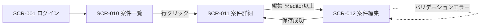
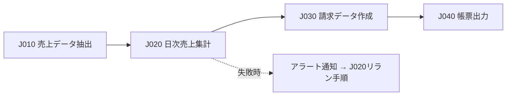

# External Design Deliverables — 基本設計（外部設計）成果物

**鉄則: いきなり hi-fi デザインを見せない。合意は粗い粒度から段階的に取る。**

外部設計は、システムが外界（ユーザー・他システム・時間）と接する「一度公開すると変えづらい境界」を決める工程であり、日本の受託開発でいう基本設計に相当する。すべての成果物に次の二役を兼ねさせること:

1. **クライアント合意文書** — 非エンジニアの発注者が読んでレビューできる粒度で書く
2. **AI実装指示** — Mermaid・表など機械可読形式で書き、そのまま実装エージェントのコンテキストに渡す

└ なぜ: 人間向けと機械向けを別文書にすると二重管理になり、必ず乖離するから。クライアントが合意したその文書がそのまま実装の入力になる状態を保つ。

## 適用範囲と隣接領域

本スキルが扱うのは **画面/UI設計とバッチ設計を中心とした基本設計成果物** の作成・レビュー・納品。

**範囲外**: API契約（OpenAPI）・データモデル（ER図・コード設計）・認証/認可・エラーレスポンスの契約設計は、インターフェース契約設計スキル（将来提供予定）の領域であり、本スキルでは扱わない。提供までは API 設計の実装パターンとして dev-core:backend-patterns を参照。

| 隣接領域 | 送り先 |
|---|---|
| 要件定義（機能一覧・業務フロー） | → requirements-definition |
| クライアントとの合意形成・説明の進め方 | → client-alignment |
| 設計レビュー会の運営・観点 | → design-review |
| 納品文書の体裁・ドキュメント全体設計 | → business-doc-design |
| テスト観点への展開 | → test-design |
| スケジュール・検収プロセスの管理 | → pm-delivery |
| AI機能そのものの設計 | → ai-system-design |
| UIコンポーネントの実装パターン | → dev-core:frontend-patterns |
| 実装時の開発原則（TDD・アーキテクチャ） | → dev-core:best-practices |
| 実装後の検証 | → dev-core:verify |

契約・検収の条項設計（基本設計書は請負契約の検収対象になることが多い）は契約領域の話であり、ここで触れる内容は法的助言ではなく実務の型。最終判断は弁護士等の専門家に委ねること。

## Step 1: インプット確認と成果物マップ

作業開始前に、要件定義の成果物（機能一覧・業務フロー・対象ロール）が揃っているか確認する。欠けていれば requirements-definition の領域に戻す。
└ なぜ: 入力が曖昧なまま画面を書くと、設計でなく想像になるから。

作成する成果物の全体像を最初にクライアントと共有する:

| 成果物 | 内容 | 推奨形式 |
|---|---|---|
| 画面一覧 | 画面ID・画面名・概要・対象ロール・URL | Markdown表（git管理） |
| 画面遷移図 | 画面間の遷移条件・分岐 | Mermaid flowchart |
| ワイヤーフレーム | レイアウト・項目配置（lo-fi） | Figma / v0 / HTMLプロトタイプ |
| 画面設計書 | 項目定義・入力チェック・アクション・権限による表示制御・URLパラメータ | 画面IDごとに1シート |
| ジョブ一覧 | ジョブID・処理概要・起動条件・依存関係・リラン可否 | Markdown表 |
| ジョブネット図 | ジョブの先行後続・依存関係 | Mermaid flowchart |
| バッチ処理設計書 | 入出力・処理単位・コミット間隔・異常時の挙動・リラン手順 | ジョブIDごとに1シート |

## Step 2: 合意の順序 — 画面一覧 → 遷移図 → ワイヤーフレーム → 詳細仕様

この順序で **段階ごとにクライアント合意を取ってから** 次へ進む。飛ばさない。

1. **画面一覧** で「どの画面を作るか・作らないか」を合意する
2. **画面遷移図** で「画面がどうつながるか」を合意する
3. **ワイヤーフレーム（lo-fi）** で「各画面に何が載るか」を合意する
4. **画面設計書（詳細仕様）** で項目・チェック・挙動を確定する

└ なぜ: いきなり hi-fi を見せると色やロゴの議論に脱線し、構造の合意が取れないから。粗い粒度の合意が先にあるほど、後段の変更が安くなる。

遷移図は正常系だけで終わらせない。モーダル・タブ・エラー状態など画面の状態が多い場合は、遷移図と別に主要画面の状態一覧を持つ。
└ なぜ: 「正常系しか描かれていない遷移図」が手戻りの典型源だから。

## Step 3: 画面設計 — OOUI で構成する

画面はタスク（手順）起点でなく **オブジェクト（名詞）起点** で構成する。業務の主要オブジェクトを列挙し、「**オブジェクト一覧 → 詳細 → アクション**」の型に落とす。
└ なぜ: 画面数が減り、CRUD API との対応も素直になるから。業務システムの画面設計の第一選択。

チェックリスト:

- [ ] **画面IDを最初に採番**し（例: `SCR-001`）、以後の変更・参照はすべてIDベースで追跡する
      └ なぜ: 画面名の変更が仕様書全体の検索性を壊すのを防ぐ。画面IDは後続設計書全体の参照キーになる。
- [ ] 項目にも物理名を最初に付与する（表示ラベルと分離する）
- [ ] 画面設計書に **権限マトリクスとの相互参照列**（ロール×画面×操作）を持たせる
      └ なぜ: 権限による表示制御の書き忘れは、認可設計との不整合を生む典型的な失敗だから。相互リンクで検出可能にする。
- [ ] 入力チェック仕様は「項目・条件・エラー時の文言/挙動」をセットで書く
- [ ] URLパラメータと初期表示条件を明記する

画面一覧テンプレート:

| 画面ID | 画面名 | 概要 | 対象ロール | URL | 権限マトリクス参照 |
|---|---|---|---|---|---|
| SCR-010 | 案件一覧 | 自組織の案件を一覧表示 | viewer 以上 | /projects | PERM-案件-閲覧 |

## Step 4: プロトタイプ活用 — 高速 hi-fi と「見た目≠進捗」

Step 2 の構造合意が取れたら、v0 等で **動く hi-fi プロトタイプを高速生成** してよい。lo-fi の速さと hi-fi の合意精度の両取りができる。
└ なぜ: lo-fi だけでは発注者の想像力に依存し「イメージと違う」リスクが残るから。

ただしプロトタイプを見せるときは、**必ず次の注意書きを添える**:

> このプロトタイプは合意のための試作品です。見た目の完成度と実装の進捗は別物であり、データ処理・権限制御・異常系はこれから実装します。

└ なぜ: 「プロトタイプ=完成間近」と誤解されると、スケジュール期待が壊れ、後の交渉がすべて不利になるから。

## Step 5: バッチ設計 — ジョブ一覧・ジョブネット・冪等性・リラン

バッチは「時間との境界」の設計。月次請求・日次連携など「動いて当たり前、落ちたら業務事故」の領域として扱う。

ジョブ一覧テンプレート:

| ジョブID | 処理概要 | 起動条件 | 実行時間帯 | 依存（先行） | リラン可否/方式 | エラーレコードの扱い |
|---|---|---|---|---|---|---|
| J020 | 日次売上集計 | J010完了イベント | 02:00-03:00 | J010 | 可/頭からリラン（冪等） | スキップし翌日再処理 |

ジョブネット図テンプレート（時刻でなく完了イベントで結合する）:

### 冪等性 — 3パターンから選んで設計書に明記する

「**同じ業務日付・同じパラメータで2回動かしても結果が同じ**」をジョブごとに保証する:

1. **ステータス列方式** — 対象レコードに処理済みフラグ/ステータスを持ち、未処理のみ抽出する
2. **DELETE-INSERT方式** — 実行単位（業務日付・トランザクションID）に紐づく出力を先に消してから書く
3. **MERGE（UPSERT）方式** — 同一キーは上書きする

└ なぜ: リラン時に「二重計上していないか」を人間が目視確認する運用は、必ず破綻するから。

### リラン設計

- [ ] **業務日付を引数化**し、処理内で `now()` を参照しない
      └ なぜ: 翌日にリランした瞬間に別の日付で動く処理は、リラン不能なジョブだから。
- [ ] ジョブを「リラン可能な最小単位」に分割する
- [ ] 途中失敗時の再開方式（失敗ジョブからの再開か、冪等性に依拠した頭からのリランか）をジョブごとに明記する
- [ ] ジョブの中から非同期ジョブを呼ばない。呼び出しはワークフローエンジン側に寄せる
      └ なぜ: エンジンから制御不能になり、リラン手順が特殊化するから。

### 突き抜け対策（予定時間内に終わらない事態）

- [ ] 多重起動防止ロック（同一ジョブの二重起動を検知しスキップ）
- [ ] 実行時間の監視としきい値アラート
- [ ] 処理の分割・並列化の余地を設計時に確保
- [ ] 暗黙の時刻依存（「3時までには終わっているはず」）で後続を組まない。明示的な先行後続・完了イベントで結合する
      └ なぜ: 時刻依存は将来のデータ増で必ず壊れるから。テスト環境と本番のデータ量差にも注意する。

## Step 6: 異常時判断基準をクライアントと事前合意する

以下は技術判断ではなく **クライアントの業務判断** である。外部設計時にヒアリングし、設計書に文書化して合意を取る:

- [ ] 突き抜け時、オンライン開始とバッチ完了のどちらを優先するか（バッチを翌日に回してよいか）
- [ ] エラー1件で全件停止か、スキップして続行か（業務ごとに明記し、スキップ分の後続処理を用意する）
- [ ] 障害時の連絡先・連絡順序・翌営業日対応でよい障害の範囲

└ なぜ: ここを曖昧にすると、障害の夜に受託側が一人で業務判断を迫られる。「異常時の判断基準の事前合意」は自分を守る設計である。

## Step 7: 設計書レビューと納品

納品前チェックリスト:

- [ ] 全成果物が画面ID・ジョブIDで相互参照されている（名前ベースの参照が残っていない）
- [ ] 遷移図・状態一覧に異常系（エラー状態・権限なし表示）が含まれている
- [ ] 画面設計書の権限列と権限マトリクスが一致している
- [ ] 全ジョブに冪等性方式・リラン方式・エラーレコードの扱いが明記されている
- [ ] 異常時判断基準の合意記録（日付・合意者）がある
- [ ] Mermaid・表が実際にレンダリングできる（壊れた図を納品しない）
- [ ] 合意済みバージョンに版番号を付け、以後の変更は変更履歴で追跡する
      └ なぜ: 基本設計書は検収対象になることが多く、「言った言わない」の保険は合意時点の版の特定から始まるから。

レビュー会の運営・指摘の扱いは design-review、納品文書の体裁は business-doc-design に従う。

## 分担線: AI がやること / 人間にしか決められないこと

| AI（このスキルを実行するエージェント）がやる | 人間にしか決められない |
|---|---|
| ワイヤーフレーム・プロトタイプの生成 | 情報アーキテクチャ（どの画面を**作らない**か） |
| 画面一覧・遷移図の Mermaid 起こし | 業務フローとの整合の最終確認 |
| 画面設計書の項目定義表ドラフト | クライアントの暗黙の期待（既存システムの操作習慣・組織事情）の吸収 |
| ジョブ定義・ジョブネット図のドラフト生成 | 締め時刻・突き抜け時の業務優先度の決定 |
| 冪等性パターンの適用・リラン手順書ドラフト | 異常時判断基準のクライアント合意そのもの |
| 設計書間の相互参照・不整合の機械的チェック | 検収・契約に関わる判断（専門家への相談を含む） |

推奨する協働の型: **AI が3案作り、人間が業務知識で1案に絞ってクライアントに見せる**。
└ なぜ: 案出しはAIが速く、絞り込みと合意形成は業務文脈を持つ人間にしかできないから。

## 定番リソース

- 上野学『オブジェクト指向UIデザイン』（技術評論社） — OOUI の正本
- 吉原庄三郎『はじめての設計をやり抜くための本 第2版』（翔泳社） — 外部設計の成果物体系の日本語定番
- フューチャー株式会社「バッチ設計ガイドライン」（future-architect.github.io/arch-guidelines） — 冪等性・リランの公開日本語ガイドの決定版
- デジタル庁デザインシステム / SmartHR Design System — 公開されている日本語デザインシステムの参照例
