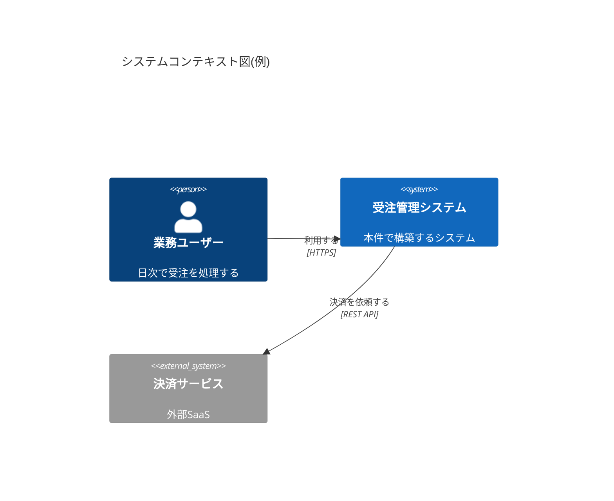
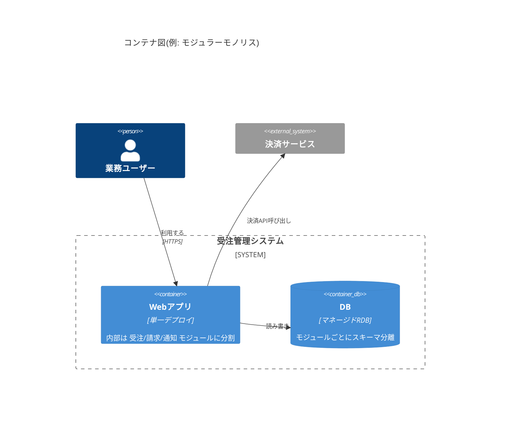

# System Architecture Selection — システム方式設計

**鉄則: 分散化の便益を顧客の言葉で説明できないなら、分散させない。**

方式設計は、要件定義完了直後〜外部設計前に行い、見積り・体制・技術スタックの前提を固定する工程である。受託ではこの決定が **見積り根拠・契約上の責任分界・検収条件** に直結し、小規模体制では「自分が運用できる複雑さの上限」を決める自己防衛の工程でもある。
└ なぜ: 運用要員がいない体制では、方式の巧拙がそのまま運用コストと睡眠時間に変換されるから。

金額・工数への翻訳は本スキルの範囲外。自組織の見積・価格判断プロセスに従うこと。

## 全体フロー

```
Step 1 特性の優先順位付け → Step 2 スタイル選定 → Step 3 C4図(2階層)
  → Step 4 ADR 作成 → Step 5 フィットネス関数で境界をCI監視
  → Step 6 成果物をリポジトリ内 markdown で維持(AIのコンテキスト供給源)
```

順序を守る。特性の優先順位が決まる前にスタイルを選んではならない。
└ なぜ: 優先特性が選定基準そのものであり、逆順は「結論ありきの後付け理由」になるから。

## Step 1: アーキテクチャ特性の優先順位を顧客と合意する

「すべて重要」は設計不能の宣言と同義。ワークショップで **上位3〜7個を強制的にランク付け** する(『Fundamentals of Software Architecture』の手法)。

1. **ISO/IEC 25010 の品質特性を語彙として候補を列挙する** — 可用性・性能効率・セキュリティ・保守性(変更容易性)・信頼性・使用性・互換性・移植性など。
   └ なぜ: 標準語彙を使うと抜け漏れが防げ、顧客との共通言語になるから。
2. **シナリオで具体化する** — ATAM の考え方だけ流用し、「刺激→応答」形式で書く(例:「月末アクセス3倍時も応答2秒以内」)。フル ATAM は小規模受託には過剰。
   └ なぜ: 「性能が大事」のままでは検証も検収もできないから。
3. **上位3〜7個に絞って順位を付ける** — 同率を認めない。順位はトレードオフ発生時の裁定ルールになる。
4. **優先順位表に顧客の合意(承認記録)を取る**。
   └ なぜ: 合意なしだと検収時に「性能が遅い」と後出しで揉める(頻出failure)。

チェックリスト:
- [ ] 候補列挙に ISO/IEC 25010 語彙を使ったか
- [ ] 上位特性がシナリオ(刺激→応答)で具体化されているか
- [ ] 3〜7個・同率なしでランク付けしたか
- [ ] 顧客合意の記録(日付・承認者)が表に残っているか

## Step 2: アーキテクチャスタイルをデシジョンツリーで選定する

**デフォルトはモジュラーモノリス。** 10人未満のチームではモノリス系が一貫して優位というのが実務コンセンサス(目安・2026年時点。要確認)。マイクロサービスの便益は、組織規模とデプロイ独立性の要求があって初めて生じる。

4基準のデシジョンツリー(1つでも NO なら即モジュラーモノリス):

```
Q1. 運用者: 分散システムを運用する専任の人間/チームは誰か?
    いない(自分一人・顧客に運用チームなし) ────→ モジュラーモノリス【即決】
    いる → Q2
Q2. チーム規模: 開発チームは複数か?
    単一チーム ────────────────────────────────→ モジュラーモノリス
    複数チーム → Q3
Q3. デプロイ独立性: チームごとに独立したデプロイサイクルが
    「顧客の言葉で」必要と説明できるか?
    説明できない ──────────────────────────────→ モジュラーモノリス
    説明できる → Q4
Q4. 障害分離: 一部機能の障害が全体を止めてはならない要件が
    明文化されているか?
    ない ──→ モジュラーモノリス(+必要箇所のみ非同期分離)
    ある ──→ マイクロサービス(または一部のみサービス分離)
```

小規模受託では Q1 で即決まることが多い。
└ なぜ: 分散トランザクション・分散トレーシングの運用は「プラットフォームチームを雇う」のと同義の負荷だから。

選定時のルール:

- [ ] **モジュール境界(≒将来の分割線)は今すぐ定義する** — 境界の切り方は戦略的DDDのコンテキスト境界に従う(→ delivery-core:domain-modeling-strategic 参照)。
      └ なぜ: モジュラーモノリスの価値は「後からマイクロサービスに切り出せる線」を最初から引いておくことにあるから。
- [ ] **分散化は顧客組織が拡大した時の追加提案にする** — 今の要件で盛らない。
- [ ] **履歴書駆動設計を禁止する** — 使いたい技術から逆算した選定は、分散の沼(分散トランザクション・トレーシング)で工数超過する典型failure。
- [ ] 大手でも文脈次第でモノリスに回帰する時代(Amazon Prime Video の事例)であることを顧客説明に使ってよい。
- [ ] 選定結果と根拠は Step 4 の ADR に必ず残す。

## Step 3: C4 モデルは2階層だけ描く

**Context 図(顧客説明用)と Container 図(実装者用)の2枚がコスパ最良。** Component/Code レベルは原則描かない。
└ なぜ: 下位階層は変化が速く保守できず、腐った図は無いより有害だから。

- [ ] Mermaid の C4 記法(または Structurizr DSL)で **テキスト管理** し、Git でレビュー可能にする
- [ ] Context 図: システム境界・利用者・外部連携だけを載せる(顧客のCTO/情シス責任者が読める粒度)
- [ ] Container 図: デプロイ単位・データストア・主要な通信経路を載せる(実装者とAIが読む粒度)
- [ ] 図を増やすのは CI で自動生成できるものだけ





## Step 4: ADR を書く(Nygard 形式)

**対象は「後から変更が難しい決定」だけ。** 全決定を書こうとすると書かなくなる。

書く/書かないの判定基準:
- 書く: 「間違いに気づいたとき、直すのに大規模な手戻りが要るか?」が YES の決定 — スタイル選定、モジュール分割、DBエンジン、同期/非同期の通信方式、認証基盤、マルチテナント方式、主要FW・ホスティング。
- 書かない: いつでも差し替えられる決定 — 命名規約の細部、軽微なライブラリ選定。
└ なぜ: ADR の読者は「未来の自分+AIエージェント」であり、彼らが「なぜこうなってる?」と聞く決定だけに価値があるから。

テンプレート(1決定1ファイル、ソースコードと同じリポジトリに置く):

```markdown
# ADR-0001: <決定を一文で表すタイトル>

## ステータス
Proposed | Accepted | Deprecated | Superseded by ADR-XXXX

## コンテキスト
<制約(技術・予算・体制・顧客指定)、検討した選択肢とそれぞれの棄却理由>

## 決定
<採用した選択肢と決め手>

## 結果
<この決定で受け入れたデメリット・波及効果・再検討のトリガー条件>
```

受託での運用ルール:
- [ ] **顧客が指定した制約は、コンテキスト欄に「顧客指定」と明記する**(例:「顧客情シスの指定により DB は X 系に限定」)。
      └ なぜ: 仕様変更・追加開発時に「この前提はどちらが置いたか」を示す交渉材料になり、紛争予防の武器になるから(条項化などの法的判断は目安であり、専門家に要確認)。
- [ ] Accepted は顧客レビュー(または社内の意思決定者の承認)後に付ける — ドラフト生成はAI、Accept 判断は人間。
- [ ] Superseded にしても古い ADR は削除しない — 履歴が価値。
- [ ] テンプレ集は adr.github.io を参照(MADR 形式でも可。形式より継続を優先)。

## Step 5: フィットネス関数でモジュール境界を CI 監視する

アーキテクチャ特性と境界ルールを自動テスト化する(『進化的アーキテクチャ』のフィットネス関数)。宣言しただけの境界は必ず侵食される。
└ なぜ: AIエージェントは「動く」実装を優先して場当たり的に境界をまたぐため、機械検出がない境界は存在しないのと同じだから。

- [ ] **依存方向チェックを毎PRのCIに入れ、違反はビルド失敗にする** — JVM系なら ArchUnit、JS/TS なら eslint-plugin-boundaries 等。
- [ ] チェック内容は Step 2 で決めたモジュール境界と一致させる(例: `billing → shared` は許可、`billing → shipping` の直接参照は禁止)。
- [ ] 特性由来の閾値(例: 主要APIの応答タイム上限)も可能な範囲でテスト化する。
- [ ] フィットネス関数の実装はAIに任せてよい。ルールの中身(何を禁止するか)は Step 2 の境界定義が正本。

## Step 6: 成果物をリポジトリ内 markdown で維持し、AI のコンテキスト供給源にする

ADR・特性優先順位表・モジュール境界定義を **AIエージェントが読める形式(リポジトリ内テキスト)で維持すること自体が設計作業** である。
└ なぜ: これがないと AI が場当たり実装で境界を壊す。引き継ぎ相手は「未来の自分+AI」であり、両者ともリポジトリしか読まないから。

配置例:

```
docs/
  adr/                       # 1決定1ファイル(ADR-0001-....md)
  architecture/
    characteristics.md       # 特性優先順位表(顧客合意の記録込み)
    c4-context.md            # Mermaid C4 Context
    c4-container.md          # Mermaid C4 Container
    boundaries.md            # モジュール境界と許可依存(フィットネス関数の正本)
```

- [ ] CLAUDE.md / AGENTS.md 相当のエントリポイントから上記へのポインタを張る
- [ ] 実装をAIに指示する際は、該当モジュールの境界定義と関連 ADR をコンテキストに含める
- [ ] 方式に関わる変更が入ったら、コードより先に ADR/境界定義を更新する(ドキュメント先行)

## 分担線: AI がやること / 人間にしか決められないこと

| AI に任せる | 人間にしか決められない |
|---|---|
| C4 図・ADR ドラフトの生成 | アーキテクチャ特性の優先順位の最終決定(顧客の予算・組織・政治の読み込み) |
| スタイル比較表(各選択肢の pros/cons)の作成 | 「この顧客の運用能力でこの構成は回るか」の判断 |
| フィットネス関数の実装 | ADR の Accept 判断(顧客合意の確定) |
| 既存コードからのアーキテクチャ逆抽出 | トレードオフの裁定と、その説明責任 |

└ なぜ: 図・コード・比較表の生成は数分でできる時代になり、人間の付加価値は「顧客の暗黙制約を特性の優先順位に翻訳すること」と「最終判断の説明責任」に集約されたから。

## 成果物チェックリスト

| 成果物 | 完了条件 |
|---|---|
| アーキテクチャ概要図(C4: Context / Container) | Mermaid/テキスト管理・Git レビュー可能 |
| ADR | 変更困難な決定がすべて1決定1ファイルで存在 |
| アーキテクチャ特性の優先順位表 | 上位3〜7・順位付き・顧客合意記録あり |
| 技術スタック選定表 | 言語・FW・DB・ホスティングと選定理由 |
| 非機能要件対応表 | → dev-core:reliability-sla-design 参照 |
| モジュール境界定義+フィットネス関数 | CI で毎PR検証されている |

## 隣接領域(範囲外の送り先)

| 隣接領域 | 送り先 |
|---|---|
| ドメイン境界の切り方(戦略的DDD・コンテキストマップ) | → delivery-core:domain-modeling-strategic |
| 要件定義・非機能要件の引き出し | → delivery-core:requirements-definition |
| 顧客ワークショップの運営・合意形成の進め方 | → delivery-core:client-alignment |
| クラウド・IaC・VPC/DNS/CDN などインフラ/ネットワーク実装設計 | → dev-core:cloud-infra-network-design |
| 脅威モデリング・認証認可などセキュリティ横断設計 | → dev-core:security-by-design |
| 可用性・性能・コスト・運用性の詳細(非機能要求グレード対応) | → dev-core:reliability-sla-design |
| 画面・バッチなど基本設計成果物 | → dev-core:external-design-deliverables |
| 実装レベルの原則(戦術的DDD・Clean Architecture・FSD) | → dev-core:best-practices |
| AI 機能を含むシステムの方式設計 | → ai-engineering:ai-system-design |
| 移行・切替の計画 | → dev-core:migration-cutover-planning |
| 運用設計・引き継ぎ | → dev-core:ops-design-handover |

## 定番リソース

版・年は目安(2026年時点)。参照時に最新版を確認すること。

- 『ソフトウェアアーキテクチャの基礎』(Mark Richards & Neal Ford) — 特性優先順位付けの正本
- 『ソフトウェアアーキテクチャ・ハードパーツ』(同著者ら) — 分散のトレードオフ分析
- 『モノリスからマイクロサービスへ』『マイクロサービスアーキテクチャ』(Sam Newman)
- 『進化的アーキテクチャ』(Neal Ford ほか) — フィットネス関数の正本
- c4model.com、adr.github.io、arc42、ISO/IEC 25010
